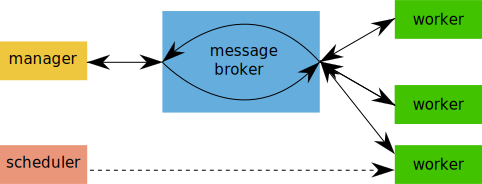

.. Copyright 2016 Doug Latornell, 43ravens

.. Licensed under the Apache License, Version 2.0 (the "License");
.. you may not use this file except in compliance with the License.
.. You may obtain a copy of the License at

..    http://www.apache.org/licenses/LICENSE-2.0

.. Unless required by applicable law or agreed to in writing, software
.. distributed under the License is distributed on an "AS IS" BASIS,
.. WITHOUT WARRANTIES OR CONDITIONS OF ANY KIND, either express or implied.
.. See the License for the specific language governing permissions and
.. limitations under the License.

.. _FrameworkArchitecture:

***********************************
NEMO Nowcast Framework Architecture
***********************************

The software architecture of a NEMO nowcast system based on this framework consists of a collection of "worker" processes that are coordinated by a "manager" process.
The workers and manager communicate by passing messages back and forth.
The messages are passed between the manager and workers by way of a "message broker" process.

    Schematic of a nowcast system manager, message broker, and workers exchanging messages, and a scheduler launching a worker.

Workers are short-lived processes that are launched when the nowcast system state is such that it is time for them to do their job.
Their processes end when their job is completed and they have communicated their success or failure to the manager.

The manager is a long-running process that keeps track of the state of the nowcast system.
It launches workers to execute tasks required to complete daily NEMO nowcast model runs,
and listens for messages from those workers that tell of their success or failure,
their progress,
or their need for information about the system state.

The message broker is also a long-running process that queues messages in both directions between the manager and the workers.
Mediating the message transfers via queues means that it is not necessary to maintain direct connections between the manager and any active workers.
This improves the robustness of the system with respect to:

* fatal errors or bugs in the manager or worker code
* network latency and reliability
* operation across a distributed collection of computers
* the occasional need in the maintenance of a nowcast system to stop and restart the manager
* etc.

A "scheduler" process is also available to launch workers at specified times.
Scheduled workers are used only for special circumstances
(typically downloading atmospheric forcing model products).
Most workers are launched by the manager process in response to system state events.
The scheduler is also a long-running process.
It periodically checks the system clock and launches workers when their scheduled time to run is reached.

A long-running log aggregator process is also available for use in nowcast systems that have workers running on different platforms than the manager.

The :py:obj:`NEMO_Nowcast` package provides Python modules that implement:

* the message broker: :py:mod:`nemo_nowcast.message_broker`
* the manager: :py:mod:`nemo_nowcast.manager`
* a class that enables workers to be programmed with minimal knowledge of the message passing mechanics that the framework uses: :py:mod:`nemo_nowcast.worker`
* A collection of :ref:`BuiltinWorkers` that are likely to be of use in any nowcast system built on the framework
* :ref:`ExampleWorkers` and configuration files sufficient to create a "toy" system that demonstrates how the workers,
  manager,
  and message broker processes interact
* the scheduler: :py:mod:`nemo_nowcast.scheduler`
* the log aggregator: :py:mod:`nemo_nowcast.log_aggregator`

The :ref:`ExampleWorkers` and the :ref:`BuiltinWorkers` provided for use in nowcast system deployments serve as examples of how to write your own worker modules.

The sections below provide detailed descriptions of the elements of the framework architecture.

.. toctree::
   :maxdepth: 2

   messaging
   message_broker
   manager
   worker
   scheduler
   log_aggregator
