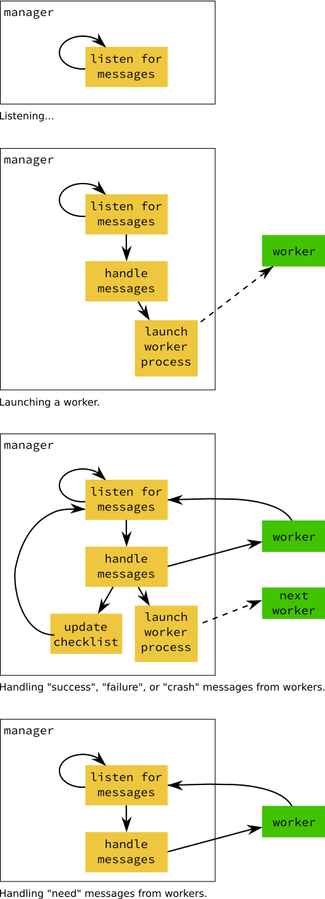

.. Copyright 2016-2019 Doug Latornell, 43ravens

.. Licensed under the Apache License, Version 2.0 (the "License");
.. you may not use this file except in compliance with the License.
.. You may obtain a copy of the License at

..    http://www.apache.org/licenses/LICENSE-2.0

.. Unless required by applicable law or agreed to in writing, software
.. distributed under the License is distributed on an "AS IS" BASIS,
.. WITHOUT WARRANTIES OR CONDITIONS OF ANY KIND, either express or implied.
.. See the License for the specific language governing permissions and
.. limitations under the License.

.. _SystemManager:

*******
Manager
*******

The :ref:`NEMO_NowcastManager` is a long-running process that keeps track of the state of the nowcast system.
It launches workers to execute tasks required to complete daily NEMO nowcast model runs,
and listens for messages from those workers that tell of their success or failure,
their progress,
or their need for information about the system state.

Message exchanges are always initiated by workers.
Workers send a message to the manager when they have something significant to report:

* Successful completion of their task
* Failure to complete their task
* Crashing due to an unhandled exception
* Needing information from the manager about the state of the nowcast system
* Providing a message to be included in the nowcast system logging output
  (only from workers running on remote hosts)

When the manager receives a message from a worker it acknowledges the message with a return message.
Those messages are defined in the :ref:`MessageRegistryConfig` section of the :ref:`NowcastConfigFile`.

    Schematic of a nowcast system manager and worker interacting at various stages of the worker's life cycle.

When the manager starts up it connects to the manager port of the :ref:`MessageBroker`.
The manager spends most of its time listening for message from workers.
Most workers are launched as a result of a :kbd:`success` message from another worker.
For special cases in which a worker's launch time depends on factors outside of the nowcast system
(such as the availability of atmospheric forcing model product files)
the :ref:`Scheduler` process  facilitates the launch of workers at a specific time of day.

When the manager receives a message from a worker it checks the :ref:`MessageRegistryConfig` to confirm that the worker is registered,
and that the type of message the worker is sending is registered.
If the worker or the type of message it sent are unregistered the manager logs a :py:data:`logging.ERROR` level event
(see :ref:`LoggingConfig` for more information)
and sends an :kbd:`unregistered worker` or :kbd:`unregistered message type` message back to the worker to inform it of the problem.
With nothing else to do,
the manager resumes listening for messages from workers.
An unregistered worker or worker message type is a system configuration error that the nowcast system administrator must resolve.
Please review :ref:`BuildingANowcastSystem` if you encounter this problem.

When the manager received a registered message type from a registered worker it uses the message type to decide how to handle the message.
The most common type of message for a worker to send is a :kbd:`success` message,
indicating that it has successfully completed its job.
:kbd:`failure` and :kbd:`crash` messages are handled in a similar way to :kbd:`success` messages.
A :kbd:`failure` message indicates that the worker has not completed its job in some way that is anticipated in its code
(i.e. not an unhandled error conditions).
A :kbd:`crash` message means that the worker encountered a unhandled exception condition.

The handling of :kbd:`success`, :kbd:`failure` and :kbd:`crash` messages is:

* If the message includes a payload,
  the manager updates the its state checklist by storing the payload at the worker's :kbd:`checklist key` that it gets from the :ref:`MessageRegistryConfig`.
  :kbd:`success` messages should always include a payload.
  :kbd:`failure` or :kbd:`crash` messages may or may not, depending on the design of the nowcast system.

* The Python module given by the :kbd:`next workers module` key in the :ref:`MessageRegistryConfig` is reloaded via Python's import machinery.
  This reloading ensures that any changes made to the module since the previous message was handled will be effective in this message's handling.

* A function called :py:func:`after_worker_name`
  (where :kbd:`worker_name` is replaced with the :kbd:`source` attribute of the message)
  is executed.
  That function is expected to return a sequence of :py:class:`nemo_nowcast.worker.NextWorker` objects that specify workers and their command-line arguments that the manager should launch next.
  The manager replies to the worker with an :kbd:`ack` message,
  launches those workers in sequence,
  then resumes listening for messages from workers.

  If an appropriate :py:func:`after_worker_name` function is not found in the :kbd:`next workers module` the manager logs a :py:data:`logging.CRITICAL` level event
  and sends a :kbd:`no after_worker function` message back to the worker to inform it of the problem.
  With nothing else to do,
  the manager resumes listening for messages from workers.
  A missing :py:func:`after_worker_name` function is a system configuration error that the nowcast system administrator must resolve.
  Please review :ref:`BuildingANowcastSystem` if you encounter this problem.

The manager also handles a small collection of :ref:`SpecialMessageTypes`.

Sometimes in the design of a worker is is useful for the worker to be able to ask the manager to provide it with an item from the system state checklist.
Those items are payloads sent to the manager by workers that completed their jobs earlier.
To accomplish that a :kbd:`need` message must be registered for the worker.
When the worker sends a :kbd:`need` message to the manager with a checklist key as the payload the manager replies by sending the value stored at that key in the checklist back to the worker as the payload of and :kbd:`ack` message,
and resumes listening for messages from workers.

The recommended way to launch the manager is to put it under the control of a process manager like `Circus`_.
Please see :ref:`NowcastProcessMgmt` for details.

.. _Circus: https://circus.readthedocs.io/en/latest/
