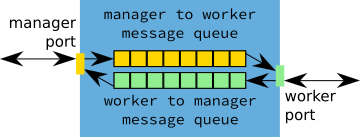

.. Copyright 2016-2019 Doug Latornell, 43ravens

.. Licensed under the Apache License, Version 2.0 (the "License");
.. you may not use this file except in compliance with the License.
.. You may obtain a copy of the License at

..    http://www.apache.org/licenses/LICENSE-2.0

.. Unless required by applicable law or agreed to in writing, software
.. distributed under the License is distributed on an "AS IS" BASIS,
.. WITHOUT WARRANTIES OR CONDITIONS OF ANY KIND, either express or implied.
.. See the License for the specific language governing permissions and
.. limitations under the License.

.. _MessageBroker:

**************
Message Broker
**************

The :ref:`NEMO_NowcastMessageBroker` is a long-running process that queues messages in both directions between the manager and the workers.
Mediating the message transfers via queues means that it is not necessary to maintain direct connections between the manager and any active workers.
This improves the robustness of the system with respect to:

* fatal errors or bugs in the manager or worker code
* network latency and reliability
* operation across a distributed collection of computers
* the occasional need in the maintenance of a nowcast system to stop and restart the manager
* etc.

When the broker is started it binds to a workers port to listen for messages from workers,
and a manager port to listen for messages from the manager.
After that,
the broker simply listens for messages and queues them in both directions between the workers and manager ports.

    Schematic of a nowcast system message broker ports and message queues.

The server on which the broker is running,
and the workers and manager port numbers that the system uses are defined in the :ref:`ZeroMQServerAndPortsConfig` section of the :ref:`NowcastConfigFile`.

.. note::
    If the manager or some of the workers run on different machines than the message broker it is necessary to ensure that the appropriate firewall rules are in place to allow traffic to pass between those machines via the worker and/or manager port(s).

The nowcast messaging system is based on the `ZeroMQ`_ distributed messaging framework.
:ref:`NEMO_NowcastMessageBroker` is a wrapper around a `ZeroMQ QUEUE device`_.
It provides configuration,
logging,
and signal handling for the :kbd:`QUEUE` device.

.. _ZeroMQ: http://zeromq.org/
.. _ZeroMQ QUEUE device: http://learning-0mq-with-pyzmq.readthedocs.io/en/latest/pyzmq/devices/queue.html

The recommended way to launch the message broker is to put it under the control of a process manager like `Circus`_.
Please see :ref:`NowcastProcessMgmt` for details.

.. _Circus: https://circus.readthedocs.io/en/latest/

.. note::
  Since manager/worker communication,
  the Circus process manager,
  and distributed logging all use ZeroMQ ports,
  it is crucial to ensure that all port numbers used are unique.
